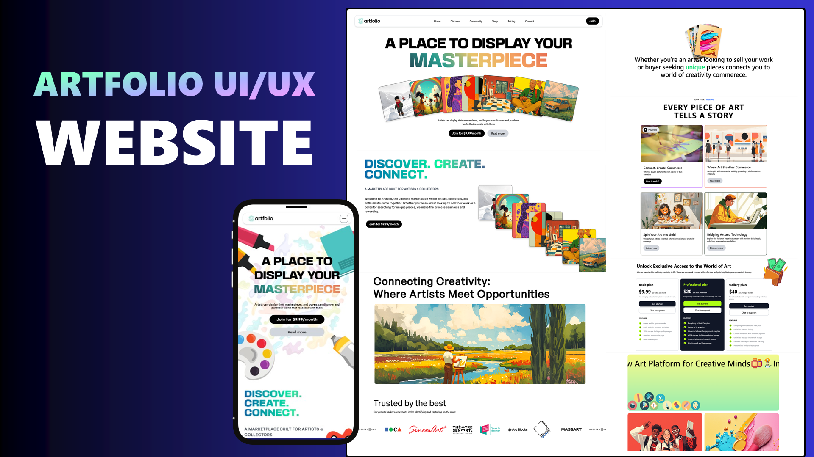

<p align="center">
  
  
  
  
  
</p>

<h3 align="center"> Modern UI/UX Website</h3>

## 📋 Table of Contents

1. 😄 [Introduction](#introduction)
2. ⚙️ [Tech Stack](#tech-stack)
3. 🔋 [Features](#features)
4. ⛏️ [Quick Start](#quick-start)

## 😄 Introduction

Artfolio is a visually engaging frontend web application built with React.js, GSAP, Matter.js, and Tailwind CSS. This project showcases creative animations, smooth interactions, and physics-based motion effects, making it an excellent reference for dynamic UI development.
With a focus on seamless user experience and performance, this project leverages:

- GSAP for stunning animations and transitions.
- Matter.js for physics-based interactions.
- React.js + Vite for a fast and modular architecture.
- Tailwind CSS for responsive and modern styling.

This project is a great starting point for anyone looking to explore animation-driven web experiences with React and advanced motion libraries.

## ⚙️ Tech Stack

- Vite
- React.js
- Tailwind
- GSAP
- Matter.js

## 🔋 Features

👉 **Seamless Animations**: Eye-catching and smooth UI animations powered by GSAP for an immersive experience.

👉 **Physics-Based Interactions**: Matter.js integration brings realistic physics, making interactions dynamic and engaging.

👉 **Modern UI/UX**: Designed with Tailwind CSS and GSAP to provide a visually appealing and fluid user experience.

👉 **Cross-Browser Compatibility**: Fully responsive and optimized across all modern web browsers.

## ⛏️ Quick Start

Follow these steps to set up the project locally on your machine.

### Prerequisites

Make sure you have the following installed on your machine:

- [Git](https://git-scm.com/)
- [Node.js](https://nodejs.org/)
- [npm](https://www.npmjs.com/) (Node Package Manager)

### Cloning the Repository

```sh
git clone https://github.com/AkshayCodesIt/artfolio.git
cd artfolio
```

### Installation
Install the project dependencies using npm:

```sh
npm install
```
Running the Project
```sh
npm run dev
```
Open http://localhost:5173 in your browser to view the project.
